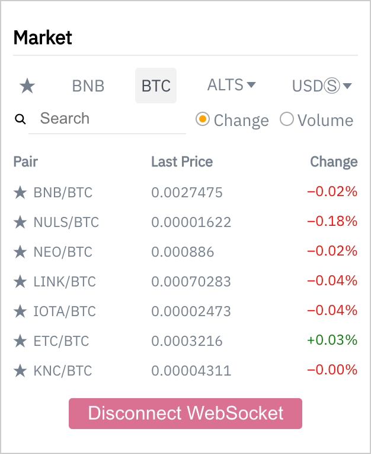

# Binance widget



Cryptocurrency prices in real-time! [Live version](https://bi-widget.vercel.app/)
Svelte version [here](https://github.com/enemycnt/bi-widget-svelte)

### Built With

- [ReactJS](https://reactjs.org/)
- [Styled components](https://styled-components.com/)
- [React window](https://github.com/bvaughn/react-window)
- [Storeon](https://github.com/storeon/storeon)
- [Testcafe](https://devexpress.github.io/testcafe/)

### Prerequisites

To run the project correctly you need to install [pnpm](https://pnpm.io/installation) and [chrome](https://www.google.com/chrome/) first

### Installing and running

A step by step series of examples that tell you how to get a development env running

Simply clone the repository

```
git clone git@github.com:enemycnt/bi-widget.git
cd bi-widget
```

then install dependencies

```
pnpm install
```

and finally run the app

```
pnpm start
```

## Running the tests

To run end to end tests you should run app in development mode

```
pnpm start --host
```

then run in another terminal tab/window

```
pnpm e2e
```

It starts testcafe tool and tests category change and text search
